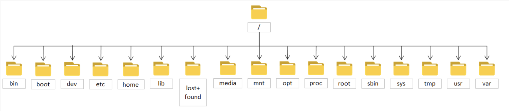

# 20建筑电气课堂笔记

# 1-linux基础(4)
## 1.1为什么使用linux？
可裁剪、可移植、免费开源
- 需演示
## 1.2虚拟机安装Ubuntu

## 1.3shell命令

|常用指令|意义|例子|
|---|---|---|
|ls|列出当前目录下的所有非隐藏文件||
|pwd|列出当前所在路径||
|cd|去到某一个目录|cd xxx/去到xxx目录|
|rm|删除某个文件，删除目录需要加-r参数|rm xxx会把xxx删除|
|gedit|编写一个文件|gedit hellow.c|
|cp|复制文件|cp hellow.c ./haha/复制hellow.c 到文件夹haha中（复制文件夹需要加 -r参数）|
|mv|移动文件|mv hellow.c heihei/|
|unzip|解压|unzip filename.zip|
|||zip -r FileName.zip DirName|
||解压|tar -xvf FileName.tar.gz（-j 压缩和解压缩 ".tar.bz2" 格式 -z 压缩和解压缩 ".tar.gz" 格式）|
||||

## 1.4文件系统
tree -L 1
- 需演示

|目录|目录放置的内容|
|---|---|
|root|root用户的家目录|
|sbin|root用户使用的命令存放目录|
|boot|存放开机启动过程所需的内容，如开机管理程序grub2|
|etc|系统的主要配置文件|
|srv|一些网络服务所需要的数据文件|
|proc|进程及内核信息存放目录，不占用硬盘空间。是一种伪文件系统（也即虚拟文件系统），存储的是当前内核运行状态的一系列特殊文件，这个目录是一个虚拟的目录，它是系统内存的映射，我们可以通过直接访问这个目录来获取系统信息。这个目录的内容不在硬盘上而是在内存里，我们也可以直接修改里面的某些文件，比如可以通过下面的命令来屏蔽主机的ping命令，使别人无法ping你的机器：echo 1 > /proc/sys/net/ipv4/icmp_echo_ignore_all|
|sys|同proc目录，用于记录CPU与系统硬件的相关信息|
|dev|所有设备文件的目录（如声卡、硬盘、光驱）|
|用户文件夹|！！！！！！！！！！！！！！！！！！！！！！|
|bin|存放系统命令的目录，如命令cat，cp，mkdir|
|home|用户家目录数据的存放目录|
|lib|存放sbin和bin目录下命令所需的库文件|
|lib32/lib64|存放二进制函数库，支持32位/64位|
|用于挂载|！！！！！！！！！！！！！！！！！！！！！！！！|
|media|用于挂载光盘，软盘和DVD等设备|
|mnt|同media作用一样，用于临时挂载存储设备|
|opt|第三方软件安装存放目录|
|usr|系统存放程序的目录，类似于在windows下的文件夹programefiles|
|临时文件夹|！！！！！！！！！！！！！！！！！！！！！！！|
|tmp|程序运行时产生的临时文件存放目录|
|var|存放内容常变动的文件目录，如系统日志文件|
|lost+found|在EXT3/4系统中，当系统意外崩溃或意外关机时，会产生一些碎片文件在这个目录下面，系统启动fcsk工具会检查这个目录，并修复已损坏的文件。|
|run|是一个临时文件系统，存储系统启动以来的信息。当系统重启时，这个目录下的文件应该被删掉或清除。|

## 1.5用户组与文件权限
```
mkdir haha
sudo touch heihei.txt
cd / & ls
```


- 看文件属性
```
ls -l 
```


>字母“-”表示该文件是一个普通文件

字母“d”表示该文件是一个目录，字母"d"，是dirtectory(目录)的缩写

注意：目录或者是特殊文件，这个特殊文件存放其他文件或目录的相关信息

字母“l”表示该文件是一个链接文件。字母"l"是link(链接)的缩写，类似于windows下的快捷方式

字母“b”的表示块设备文件(block)，一般置于/dev目录下，设备文件是普通文件和程序访问硬件设备的入口，是很特殊的文件。没有文件大小，只有一个主设备号和一个辅设备号。一次传输数据为一整块的被称为块设备，如硬盘、光盘等。最小数据传输单位为一个数据块(通常一个数据块的大小为512字节)

字母为“c”表示该文件是一个字符设备文件(character)，一般置于/dev目录下，一次传输一个字节的设备被称为字符设备，如键盘、字符终端等，传输数据的最小单位为一个字节。

字母为“p”表示该文件为命令管道文件。与shell编程有关的文件。
字母“s”表示该文件为sock文件。与shell编程有关的文件。

>rw-r--r--

分三部分看，不同用户的权限
rw-:root
r--:yang
r--:gest

# 2-交叉编译，实验箱的使用(4)
```
通过usb-to-saril链接实验箱：
root@omapl138-Tronlong:~# ifconfig
eth0      Link encap:Ethernet  HWaddr 16:00:d0:11:6a:ef
          inet addr:192.168.1.115  Bcast:0.0.0.0  Mask:255.255.255.0
          UP BROADCAST RUNNING MULTICAST  MTU:1500  Metric:1
          RX packets:1804 errors:0 dropped:612 overruns:0 frame:0
          TX packets:5 errors:0 dropped:0 overruns:0 carrier:0
          collisions:0 txqueuelen:1000
          RX bytes:325477 (317.8 KiB)  TX bytes:874 (874.0 B)
          Interrupt:33

lo        Link encap:Local Loopback
          inet addr:127.0.0.1  Mask:255.0.0.0
          UP LOOPBACK RUNNING  MTU:16436  Metric:1
          RX packets:162 errors:0 dropped:0 overruns:0 frame:0
          TX packets:162 errors:0 dropped:0 overruns:0 carrier:0
          collisions:0 txqueuelen:0
          RX bytes:247047 (241.2 KiB)  TX bytes:247047 (241.2 KiB)


```


## 2.1 ssh通信服务与FTP网盘
```
安装ssh服务
apt-get update 更新软件源
sudo apt-get install  openssh-server
如果没有联网，重启网络：
/etc/init.d//networking restart
重启ssh服务：
sudo /etc/init.d/ssh restart
ssh root@192.168.1.134  用户名@用户地址
scp testssh root@192.168.1.33:/ 文件所在路径
用户名@用户地址：文件存储路径
密码：TL
```
windos可以用xftp共享文件：（虚拟机也可以用共享文档）
- 需演示
## 2.1拨码开关
- 需演示
## 2.2win11驱动串口驱动
http://www.prolific.com.tw/US/ShowProduct.aspx?p_id=223&pcid=126
或者使用CH341

## 2.3实验箱中的hellowold
### 查看试验箱IP地址
```
root@omapl138-Tronlong:/# ifconfig
eth0      Link encap:Ethernet  HWaddr 16:01:40:12:6a:ef
          inet addr:192.168.1.55  Bcast:0.0.0.0  Mask:255.255.255.0
          UP BROADCAST RUNNING MULTICAST  MTU:1500  Metric:1
          RX packets:100340 errors:0 dropped:4720 overruns:0 frame:0
          TX packets:2 errors:0 dropped:0 overruns:0 carrier:0
          collisions:0 txqueuelen:1000
          RX bytes:7041229 (6.7 MiB)  TX bytes:656 (656.0 B)
          Interrupt:33

lo        Link encap:Local Loopback
          inet addr:127.0.0.1  Mask:255.0.0.0
          UP LOOPBACK RUNNING  MTU:16436  Metric:1
          RX packets:168 errors:0 dropped:0 overruns:0 frame:0
          TX packets:168 errors:0 dropped:0 overruns:0 carrier:0
          collisions:0 txqueuelen:0
          RX bytes:221739 (216.5 KiB)  TX bytes:221739 (216.5 KiB)

```
如果没有输出192.168.1.55类似的IP,需要重启网络重新获取IP
```
root@omapl138-Tronlong:/# /etc/init.d/networking restart
Reconfiguring network interfaces... [   68.230618] davinci_mdio davinci_mdio.0: resetting idled controller
[   68.255581] net eth0: attached PHY driver [SMSC LAN8710/LAN8720] (mii_bus:phy_addr=davinci_mdio-0:00, id=7c0f1)
udhcpc (v1.20.2) started
Sending discover...
[   70.255717] PHY: davinci_mdio-0:00 - Link is Up - 100/Full
Sending discover...
Sending select for 192.168.1.123...
Lease of 192.168.1.123 obtained, lease time 7200
/etc/udhcpc.d/50default: Adding DNS 192.168.1.1
/etc/udhcpc.d/50default: Adding DNS 0.0.0.0
done.
```
如果输入ifconfig，虚拟机说没有net-tools
```
sudo apt-get install net-tools
```
链接试验箱：
```
ssh root@192.168.1.123
The authenticity of host '192.168.1.123 (192.168.1.123)' can't be established.
RSA key fingerprint is SHA256:C7yUL9sT5T2aLXjMT+GwjRHPXkZMXowdPapYLSt1p5A.
Are you sure you want to continue connecting (yes/no)? yes
Warning: Permanently added '192.168.1.123' (RSA) to the list of known hosts.
root@192.168.1.123's password: TL

root@omapl138-Tronlong:~# 

```


###查看虚拟机自带的gcc
```
1-查看gcc版本
gcc -v
2-编辑一个hellowold程序测试
#include <stdio.h>
int main (void)
{
    printf("hellowold\n");
    return 0;
}
3-编译
gcc hellow.c  
或者自定义输出文件名：
gcc hellow.c -o hellow

```
不用交叉编译直接发送文件：
```
yang@ubuntu:~/Desktop/code/hellow$ scp hellowold root@192.168.1.123:
root@192.168.1.123's password: 
hellowold

并没有输出hellow，而是段错误：
root@omapl138-Tronlong:~# ./hellowold 
./hellowold: line 16: syntax error: EOF in backquote substitution
```


###gcc与arm-gcc的关系
```
解压：
sudo tar jxvf /mnt/hgfs/shareVM/arm-2009q1-203-arm-none-linux-gnueabi-i686-pclinux-gnu.tar.bz2 -C ~
修改系统环境变量：
sudo gedit /etc/profile
在 profile 文件最后添加以下语句：
export PATH=$PATH:/homg/yang/arm-2009q1/arm-none-linux-gnueabi/bin
环境生效：
source /etc/profile & sudo reboot
查看是否安装成功：
arm-none-linux-gnueabi-gcc -v
```


交叉编译hellow.c
```
使用gcc编译器，编译hellow.c文件，-o（-out输出为：hellow-x86xxx名字的可执行文件），这个文件可以再x86端运行。
gcc hellow.c -o hellow-x86xxx

使用arm-none-linux-gnueabi-gcc编译器，编译hellow.c文件，-o（-out输出为：hellow-armyunxing名字的可执行文件），这个文件可以再arm端运行
arm-none-linux-gnueabi-gcc hellow.c -o hellow-armyunxing
```


# 3-led及其驱动安装(4)
## 3.1安装LED驱动
1、通过scp命令将驱动文件led.ko 发送给开发板
@ubuntu:~/Desktop$ scp led.ko root@192.168.1.120:
2、通过insmod命令安装驱动
root@omapl138-Tronlong:~# insmod led.ko 
3、装完驱动后，会生成相对应的LED灯文件；
```
root@omapl138-Tronlong:/sys/devices/platform/leds-gpio.1/leds# ls
user_led0  user_led1  user_led2  user_led3
```
4 可以看到每个user_led0~3中都有一个叫britness的文件
```
比如打开LED3：
echo 1 > /sys/devices/platform/leds-gpio.1/leds/user_led3/brightness
比如关闭LED3：
echo 0 > /sys/devices/platform/leds-gpio.1/leds/user_led3/brightness

5、实现用C语言开关灯，使用system（）函数；
system("echo 0 > /sys/class/leds/user_led3/brightness");

示例,实现led0与led1每隔0.5s交替闪烁
int main(void)
{
	system("echo 0 > /sys/class/leds/user_led0/brightness");
	system("echo 0 > /sys/class/leds/user_led1/brightness");
	system("echo 0 > /sys/class/leds/user_led2/brightness");
	system("echo 0 > /sys/class/leds/user_led3/brightness");
	while(1)
	{
		
		system("echo 1 > /sys/class/leds/user_led0/brightness");
		sleep(0.5);
		system("echo 0 > /sys/class/leds/user_led0/brightness");
		system("echo 1 > /sys/class/leds/user_led1/brightness");
		sleep(0.5);
		system("echo 0 > /sys/class/leds/user_led1/brightness");

	}
	return 0;
}
```
5-将C语言程序放到虚拟机ubuntu中进行编译，编译器选择arm-none-linux-gnueabi-gcc：
```
yang@ubuntu:~/Desktop$ arm-none-linux-gnueabi-gcc LED.c -o led-arm
编译完成后发送给arm板：
scp led-arm root@192.168.1.120:
在arm端运行：
root@omapl138-Tronlong:~# ./led-arm
```

# 4-文件读写(4)
LCD屏在安装完驱动后，会被系统映射成一个文件：/dev/fb0；
想让屏幕显示颜色，必须往文件中写入像素点：


## 4.1位图、色深、色域
- 8位图、16位图、32位图


- 如何将24位图转化为16位图？


## 4.2函数使用方法查询：
```
man open()
```
```
1、打开文件
open（）
头文件：
#include <sys/types.h>
#include <sys/stat.h>
#include <fcntl.h>
       
格式：open(const char *pathname, int flags);
const char *pathname：代表你想打开哪一个文件；
int flags：有三种参数，可以在open（）函数中添加参数，代表你打开文件想干啥；
 O_RDONLY： 打开之后只能读取文件中的内容不能编辑
 O_WRONLY：打开之后只能写，不能读
 O_RDWR：可读可写
 返回值：打开成功，返回文件描述符fb（file discriptor），如果打开失败返回-1；

2、写文件
write（）
头文件：#include <unistd.h>
格式：ssize_t write(int fd, const void *buf, size_t count);
int fd：填入文件描述符
const void *buf：需要写入的内容
size_t count：想写的内容有多大

返回值：如果成功0，失败-1；

3、关闭文件
close（）
头文件：#include <unistd.h>
格式：int close(int fd);
int fb：文件描述符
返回值：：如果成功0，失败-1；
```

参考代码：
```
#include <sys/types.h>
#include <sys/stat.h>
#include <fcntl.h>
#include <unistd.h>
#include <stdio.h>
#define LCD_PATH "/dev/fb0"


unsigned short color = 0;
int lcd_fb,i,red,green,blue;
int main (void)
{


	// red= 0xff*(0x1f/0xff);
	// green=0xff*(0x3f/0xff);
	// blue=0x00*(0x1f/0xff);
	int r = (0xff * 0x1f) / 0xff;
	int g = (0x00 * 0x3f) / 0xff;
	int b = (0x00 * 0x1f) / 0xff;
	color= (r<<11)|(g<<5)|b;
	printf("r%x\n",r);
	printf("g%x\n",g);
	printf("b%x\n",b);
	printf("color%x\n",color);
	// color=0xffe0;
	//1-打开文件
	lcd_fb = open(LCD_PATH, O_WRONLY);
	if (lcd_fb == -1)
	{
		printf("open lcd failure\n");
		return -1;
	}
	//2-写内容
	for (i=0;i<800*480;i++)
	{
		write(lcd_fb, &color, sizeof(color));
	}

	//关闭文件
	close(lcd_fb);
}

}
```
作业：屏幕上同时显示三种任意颜色
进阶：显示任意一张24位图。
提示：
1-前56字节保存有图像大小信息，图像的像素点逆序存放。
2-根据当前图像大小，使用循环语句忽略掉部分像素点读取操作，可将图片变为800*480.
3-转换像素深度
4-写入
# 5-qt界面设计(4)
## 5.1QT编译与安装
### 5.2.1安装arm端可用的qt编译器
```
解压安装包到用户目录
tar zxvf qt-everywhere-opensource-src-4.8.3.tar.gz -C ~
进入qt的解压文件中：
cd /home/yang/qt-everywhere-opensource-src-4.8.3
安装g++：
sudo apt-get install g++
复制配置文件
cp -a mkspecs/qws/linux-arm-g++/ mkspecs/qws/linux-omapl138-g++
修改配置文件：
sed -i "s/arm-linux/arm-none-linux-gnueabi/g" mkspecs/qws/linux-omapl138g++/qmake.conf
设置安装配置：
echo -e "o\nyes" | ./configure -prefix /home/tl/qt-arm-4.8.3 -embedded arm -xplatform qws/linux-omapl138-g++ -no-webkit -qt-libtiff -qt-libmng -no-neon -qtlibinfix E
编译安装包(30min)
make -j4
```

```
这一步如果编译失败：需要执行：make clean；然后再重复上一步make -j4；或更少的编译线程make -j2
安装：
sudo make install(10min)


```
### 5.2.2安装x86端可用的qt编译器
```
删除旧的安装包：
cd ~
sudo rm qt-everywhere-opensource-src-4.8.3/ -r
设置安装路径：
echo -e "o\nyes" | ./configure -prefix /home/yang/qt-x86-4.8.3 -no-gtkstyle
编译安装：
make -j4 && make install(40min)

```
安装qt-creater图形界面：
./qt-creator-linux-x86-opensource-2.6.1.bin
## 5.2实现QT界面点亮一个灯
配置编译器：

新建第一个工程：


# 6-应用管理(4)（视频14（的第14分钟）~视频15的最后）
https://space.bilibili.com/29386070/video
```
放图标：
/usr/share/matrix-gui-2.0/apps/images
创建放应用的文件夹，存放shell脚本与自己编译出来的应用：
mkdir /usr/share/matrix-gui-2.0/apps/ledsys

编辑桌面配置
vi /usr/share/matrix-gui-2.0/apps/tl_submenu/ledsys.desktop
```
桌面图标配置
```
[Desktop Entry]
Name=2019xxxx
Type=Application
Icon=/usr/share/matrix-gui-2.0/apps/images/xxx.png
Exec=/usr/share/matrix-gui-2.0/apps/tl_led/led.sh
X-MATRIX-DisplayPriority=5
ProgramType=gui
```
写一个自动安装驱动后运行ledsys得shell脚本,led.sh:
```
#!/bin/sh
insmod /usr/share/matrix-gui-2.0/apps/tl_led/led.ko
/usr/share/matrix-gui-2.0/apps/tl_led/LEDsys
```

注意xxx.png像素需要<96*96像素：
# 7-上机考核（4）
## 1-qt界面控制4个LED灯
## 2-4个bool型个按键分别控制
## 3-实验报告（详细得实施过程）+实验结果录像
## 4-图标是自己名字，学号是应用名称